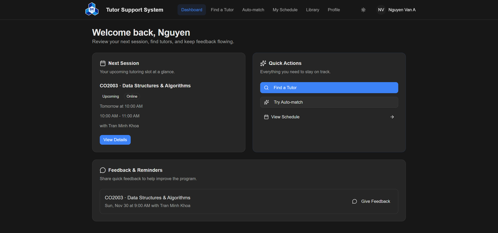

# HCMUT Tutor Support System (MVP)

**Course:** Software Engineering - CO3001



## 📌 Project Overview

This repository contains the **Minimum Viable Product (MVP)** for the HCMUT Tutor Support System. It is a high-fidelity frontend application designed to digitize and streamline the tutoring program at the university.

The MVP focuses primarily on the **Student Booking Lifecycle**, implementing an interactive end-to-end flow for finding, matching, and scheduling tutoring sessions. Other modules (such as Tutor Management and Staff Administration) are included as visual demonstrations to showcase the intended user experience and architectural design.

-----

## 🚀 Features & Scope

### 1\. Functional Core (Interactive)

These features are powered by internal logic and mock data to demonstrate the primary value proposition:

  * **Student Dashboard:** View upcoming sessions, quick actions, and feedback prompts.
  * **Tutor Discovery:**
      * **Manual Search:** Robust filtering by Department, Subject, and Modality.
      * **Auto-Match:** Algorithm to recommend a specific tutor based on user preferences (Subject, Time Window, Modality).
  * **Booking Lifecycle:** Complete flow to select a tutor, choose a specific time slot, and confirm a booking.
  * **Schedule Management:** Interactive Calendar and List views with filtering for *Upcoming* vs. *Past* sessions.
  * **Session Details:** Retrieval of session logistics, meeting links, and participant info.

### 2\. Static & Demonstrative UI (Visual Reference)

These features are implemented to demonstrate complex UI flows but are self-contained and **do not synchronize data** with the Student Core in this MVP:

  * **Tutor Availability Management:** A sophisticated UI allows tutors to define "Recurring Weekly Patterns" and manage capacity.
    > **Note:** Changes made here do not dynamically update the slots visible to students in the booking flow for this release.
  * **Library:** Allows searching and filtering university resources. The "Attach to Session" action is a UI demonstration and does not persist data to the session detail drawer.
  * **Profiles:** Users can edit personal information, but data is state-local and resets upon application reload.
  * **Feedback:** The feedback dialog captures input and validates forms but alerts the result to the console rather than a database.

### 3\. Simulated Authentication Flow

To facilitate testing without external dependencies, the authentication process is simulated:

  * **Mock SSO:** The "Sign In" button on the landing page simulates a redirect to the HCMUT Central Authentication Service (CAS).
  * **Immediate Callback:** The system simulates a successful authentication callback.
  * **Role Selection:** Multi-role users (like the mock user "Nguyen Van A") are presented with a Role Chooser to select their context (Student or Tutor) for the current session.

-----

## 🛠 Technical Stack

| Category | Technology |
| :--- | :--- |
| **Framework** | React (via Vite) |
| **Language** | TypeScript |
| **Styling** | Tailwind CSS |
| **UI Components** | shadcn/ui |
| **State Management** | React Context API (`AuthContext`, `ThemeContext`) |
| **Data Layer** | Singleton Repositories (`SessionRepository`, `TutorRepository`) |

-----

## ⚙️ Installation & Setup

Ensure you have **Node.js (v18+)** installed.

**1. Clone the repository:**

```bash
git clone https://github.com/dathuynhcsk23/tutor-support-system-1.git
cd tutor-support-system-1
```

**2. Install dependencies:**

```bash
npm install
```

**3. Run the local development server:**

```bash
npm run dev
```

**4. Access the application:**
Open your browser and navigate to `http://localhost:5173`.

-----

## ⚠️ Known Limitations

As an MVP focused on the student experience, the following limitations exist:

1.  **Data Persistence:** Data is stored in-memory using Singleton Repositories. **Refreshing the browser will reset the application to its initial state.**
2.  **Decoupled Data Layers:** While the mock user exists as both a Student and a Tutor, the data layers are currently decoupled to allow independent testing of the Student Booking flow without requiring complex availability configuration first.
3.  **Missing Integrations:**
      * **SSO Integration:** In a production environment, the "Sign In" button on the landing page is supposed to redirect the user to the HCMUT Central Authentication Service (CAS). The user would enter credentials on the university's domain. In this MVP, the system simulates a successful callback, immediately authenticating the user instead.
      * **Session Materials:** The `SessionDetailsDrawer` does not yet display resources attached from the Library.
      * **Admin Portal:** Routes and interfaces for Program Coordinators (Staff) are not included in this release.

-----

*This project is an assignment for the Software Engineering course at Ho Chi Minh City University of Technology (HCMUT).*
